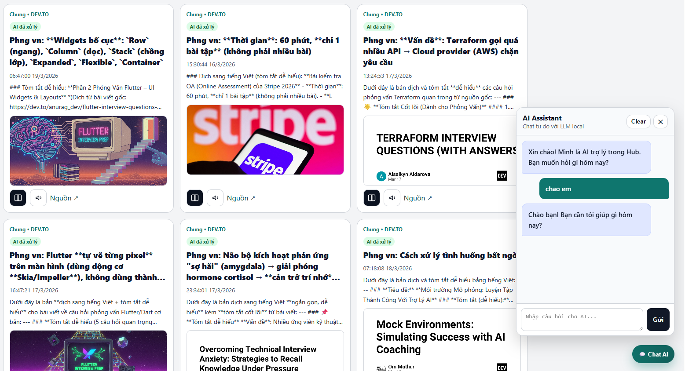
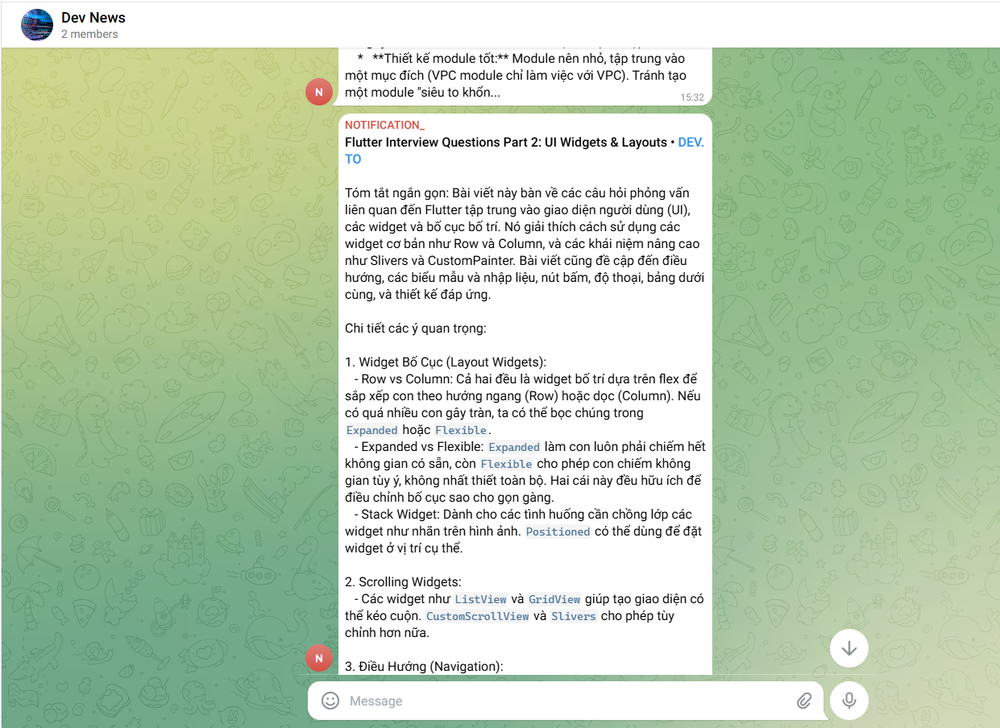

# ISD Ecosystem - Intelligent Security & Global Intelligence Watchdog

ISD (Intelligent Software Developer) is a comprehensive automation ecosystem designed to crawl, process, and analyze information from global RSS feeds. It provides intelligent security signaling, automated summarization, and seamless translation to empower users with global insights without language barriers.

## 🌟 Core Features

- **Intelligent Security Watchdog**: Automatically detects and alerts on security threats, CVEs, and infrastructure incidents from global sources.
- **AI-Powered Summarization & Translation**: Leverages LLMs (Ollama, OpenRouter, OpenAI) to summarize complex news and translate them into your preferred language.
- **Smart Industry Insights**: Perfect for tracking tech trends, interview preparation (case studies, troubleshooting), and corporate intelligence.
- **Multi-Channel Notifications**: Receive instant updates via **Telegram** groups tailored to specific teams (e.g., Dev, Security, Management).
- **Interactive Knowledge Hub**: A sleek web dashboard to browse aggregated articles, plus an **AI Chat** interface for deep-diving into specific topics.
- **Admin Management**: Easy-to-use administrative interface to manage sources, teams, and system configurations.

## 🛠 How It Works

1.  **Crawl**: System monitors global RSS feeds based on your configured sources.
2.  **Process**: AI triggers to translate, summarize, and extract key insights.
3.  **Notify**: Instant alerts are sent to designated Telegram chats.
4.  **Explore**: Access the **ISD Hub** to read full reports and chat with the AI about any article.

## 🚀 Quick Start

### 🪟 For Windows
1.  **Clone the Repository**:
    ```bash
    git clone https://github.com/jsc2017605097/isd-ai-intelligence
    cd isd-ai-intelligence
    ```
2.  **Run Installer**: Double-click the **`install.bat`** file. It will set up the environment and dependencies automatically.
3.  **Configure**: Run `isd install` in your terminal to initialize the database and AI providers.

### 🐧 For Linux / macOS
1.  **Clone the Repository**:
    ```bash
    git clone https://github.com/jsc2017605097/isd-ai-intelligence
    cd isd-ai-intelligence
    ```
2.  **Run Setup**:
    ```bash
    bash install.sh
    ```
3.  **Initialize**: Run `isd install` to complete the setup.

## ⚙️ Configuration & Management

You can manage the system via the **Admin Dashboard** (usually at `http://localhost:8000/admin`) or using the **ISD CLI**:

- `isd install`: Setup or resume installation (venv, npm, db).
- `isd start`: Launch all services (Core, Worker, Beat, Hub API).
- `isd stop`: Stop all background services.
- `isd status`: Check the operational status of all components.
- `isd config ai`: Quickly switch or configure AI providers.

## 📸 Screenshots & Media

To add your own screenshots:
1.  Place your images in the `docs/images/` directory.
2.  Update the links below:


*Figure 1: ISD Hub Dashboard*


*Figure 2: Telegram Chat*

---
*"Turning global news into your actionable intelligence."*
